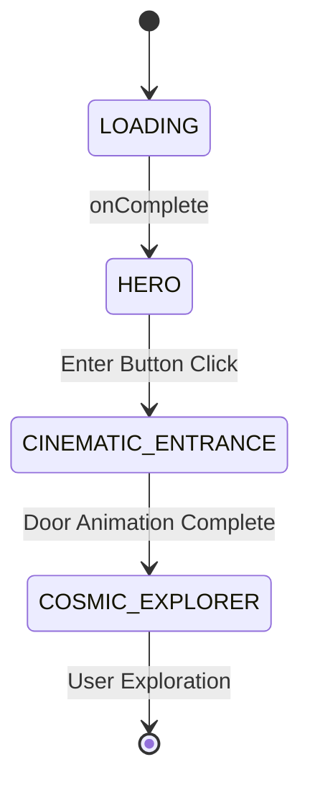

# 🌌 Wakanda Forever — Immersive Cinematic UI

<div align="center">


**An immersive, scroll-driven 3D cinematic experience inspired by Wakanda Forever**

[Live Demo](#) · [Features](#-features) · [Getting Started](#-getting-started) · [Architecture](#-architecture)

</div>

---

## ✨ Overview

This project is a **cinematic web experience** that showcases an immersive space exploration UI with smooth animations, interactive 3D canvas rendering, and a theatrical loading sequence. Built with modern web technologies, it delivers a premium, movie-trailer-like experience right in the browser.

---

## 🚀 Features

### 🎬 Cinematic Loading Sequence

- **Animated Loader** with progress bar that follows a realistic loading curve
- **Wakanda-inspired branding** with custom sprite logos and text animations
- **Slide-up curtain exit animation** for seamless scene transitions

### 🌟 Hero Section

- **Dynamic light beam effects** with configurable angles
- **Parallax mouse tracking** for depth perception
- **GSAP-powered entrance animations** with staggered reveals
- **Interactive "Enter Experience" button** with hover states

### 🌌 Galaxy Entrance Portal

- **Multi-layered door opening sequence** with zoom transitions
- **Particle system overlay** for cosmic dust effects
- **Flash transition effects** with blend modes
- **Smooth camera push-through animation**

### 🪐 Cosmic Explorer (3D Canvas)

- **Custom 3D projection system** with perspective camera
- **Interactive planet navigation** — click to dock with crew member planets
- **Scroll/wheel-based camera movement** through space
- **Pinch-to-zoom** and **drag-to-pan** touch controls for mobile
- **Dynamic star field** with parallax depth layers
- **Constellation lines** connecting celestial bodies
- **Nebula cloud rendering** with gradient overlays
- **UFO animation** with orbit paths
- **Holographic info cards** for docked planets
- **Spatial audio feedback** with oscillator-based sounds

### 📱 Responsive Design

- **Mobile-optimized controls** with on-screen buttons
- **Touch gesture support** (tap, drag, pinch)
- **Adaptive canvas rendering** based on viewport

---

## 🛠️ Tech Stack

| Technology         | Purpose                         |
| ------------------ | ------------------------------- |
| **Next.js 16**     | React framework with App Router |
| **React 19**       | UI components with hooks        |
| **TypeScript**     | Type-safe development           |
| **GSAP**           | High-performance animations     |
| **Lenis**          | Smooth scroll library           |
| **Tailwind CSS 4** | Utility-first styling           |
| **HTML Canvas**    | Custom 3D rendering             |
| **Web Audio API**  | Spatial sound effects           |

---

## 📁 Project Structure

```
wakanda-forever/
├── app/
│   ├── page.tsx              # Entry point
│   ├── layout.tsx            # Root layout
│   └── globals.css           # Global styles & theme
├── components/
│   ├── Hero.tsx              # Main hero section with light beams
│   ├── GalaxyEntrance.tsx    # Portal transition sequence
│   ├── SceneController.tsx   # State machine for scene switching
│   ├── canvas/
│   │   ├── CosmicExplorer.tsx   # 3D space exploration
│   │   ├── MobileControls.tsx   # Touch controls overlay
│   │   └── particles.tsx        # Particle system
│   ├── loader/
│   │   ├── Loader.tsx           # Loading screen
│   │   ├── WakandaTextLogo.tsx  # Animated text logo
│   │   └── logoSection.tsx      # Logo component
│   └── common/
│       ├── SpriteLogo.tsx       # Sprite-based logo
│       └── Button.tsx           # Reusable button
├── constants/
│   └── cosmic-explorer.ts    # Crew data & configuration
├── lib/
│   ├── cosmic-renderer.ts    # Canvas drawing utilities
│   ├── audio.ts              # Sound effect helpers
│   ├── particles.ts          # Particle physics
│   └── utils.ts              # Utility functions
└── public/
    ├── *.png, *.webp         # Image assets
    └── space-music.mp3       # Ambient audio
```

---

## 🎮 Scene Flow



---

## 🏁 Getting Started

### Prerequisites

- Node.js 18+
- npm or pnpm

### Installation

```bash
# Clone the repository
git clone https://github.com/Kendrick-Oppong/wakanda-forever.git

# Navigate to project directory
cd wakanda-forever

# Install dependencies
npm install

# Start development server
npm run dev
```

Open [http://localhost:3000](http://localhost:3000) to experience the magic ✨

### Build for Production

```bash
npm run build
npm start
```

---

## 🎨 Theme Customization

The app uses CSS custom properties for theming:

```css
:root {
  --background: #0a0a0a;
  --foreground: #ededed;
  --cosmic-green: #00ff7f;
}
```

The cosmic crew members and their planets are configured in:

```typescript
// constants/cosmic-explorer.ts
export const COSMIC_CREW = [
  { name: "HANNAH BEACHLER", role: "PRODUCTION DESIGNER", color: "#FFD700" },
  { name: "JASMINE ALEXIA", role: "STORYBOARD ARTIST", color: "#00FF7F" },
  // ... more crew members
];
```

---

## 🎭 The Cosmic Crew

| Crew Member      | Role                 | Planet Color     |
| ---------------- | -------------------- | ---------------- |
| Hannah Beachler  | Production Designer  | 🟡 Gold          |
| Jasmine Alexia   | Storyboard Artist    | 🟢 Cosmic Green  |
| Alícia Díaz      | Sculptor             | 🟣 Magenta       |
| Ruth Carter      | Costume Designer     | 🔵 Cyan          |
| Ludwig Göransson | Composer             | 🟠 Orange        |
| Ryan Coogler     | Director & Visionary | 💜 Secret Purple |

---

## 🎬 Key Interactions

1. **Scroll/Wheel** — Navigate through space (Z-axis movement)
2. **Click/Tap** — Dock with planets to reveal crew info
3. **Drag** — Pan the camera horizontally/vertically
4. **Pinch** — Zoom in/out on mobile devices
5. **Mobile Controls** — On-screen arrows and zoom buttons

---

## 📜 License

This project is for educational and demonstration purposes.
